<div align="center">

</div>

<div align="center">

```
building things that (hopefully) don't break
```

</div>

---

<table border="0" cellpadding="0" cellspacing="0" width="100%">
<tr>
<td width="60%" valign="top">

## ◈ about me

hey, i'm **zeyad** — a full-stack developer who enjoys building websites, backend systems, and the occasional tool that scratches my own itch.

- 🛠️ i like making things simple, fast, and easy to understand
- 🌐 currently building websites for clients and learning as i go
- 🧠 always poking at how computers actually work under the hood
- 📍 egypt

</td>
<td width="5%"></td>
<td width="35%" valign="top" align="center">


</td>
</tr>
</table>

---

## ◈ languages

<div align="center">
  
</div>

## ◈ frameworks & libraries

<div align="center">
  
</div>

## ◈ databases & cloud

<div align="center">
  
</div>

## ◈ tools & environments

<div align="center">
  
</div>

## ◈ github stats

<div align="center">
  
</div>

---

## ◈ currently listening to

<div align="center">
  <a href="https://github.com/kittinan/spotify-github-profile">
    
  </a>
</div>

<div align="center">
  
</div>
